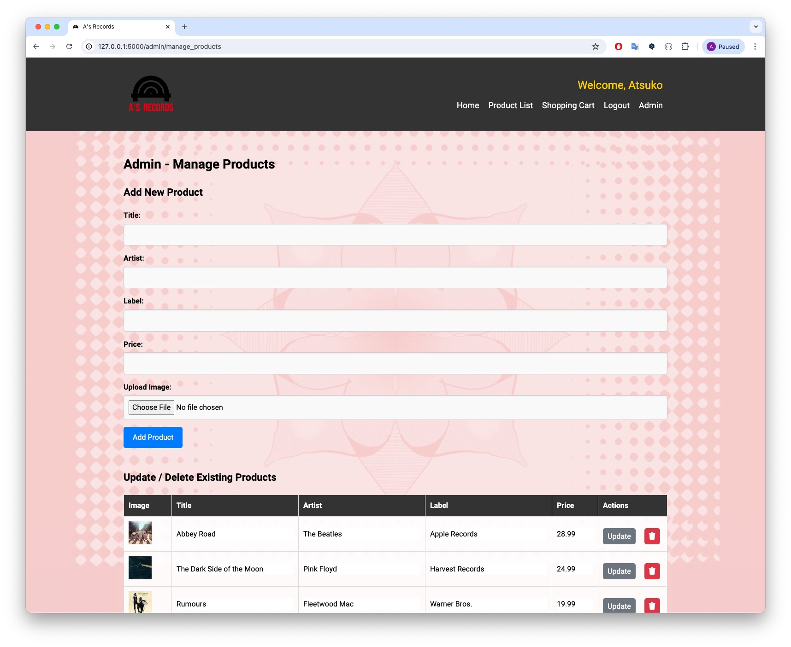
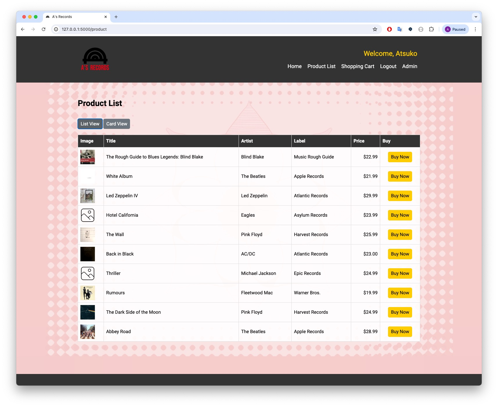
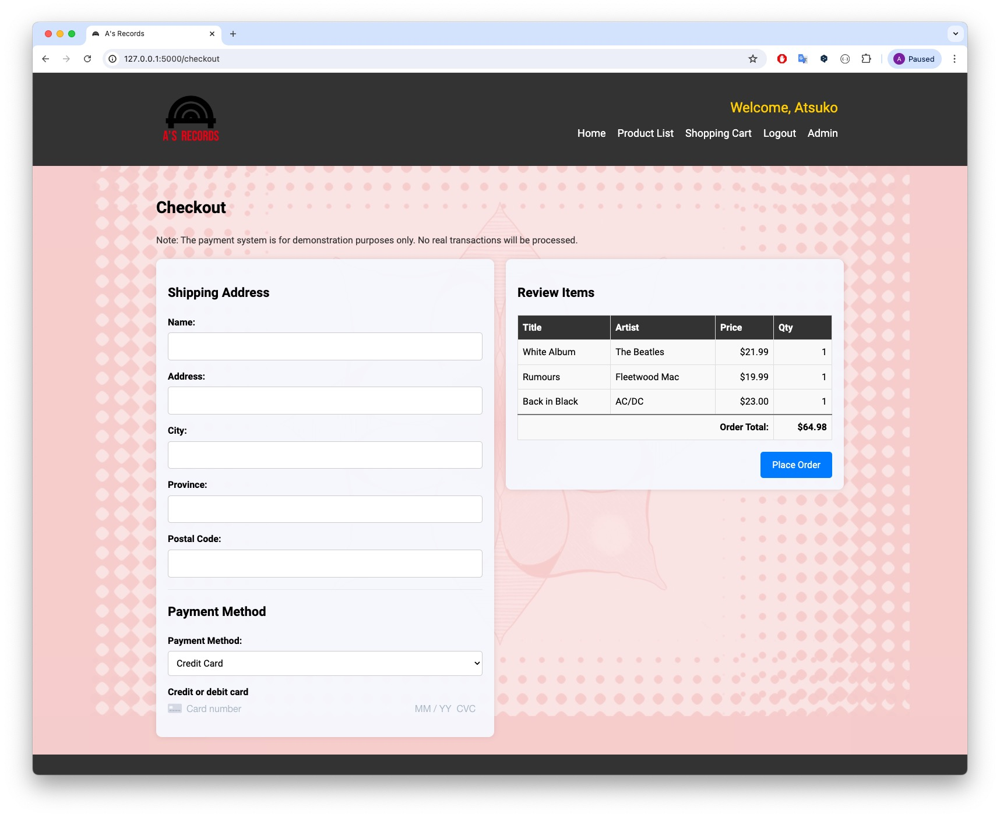
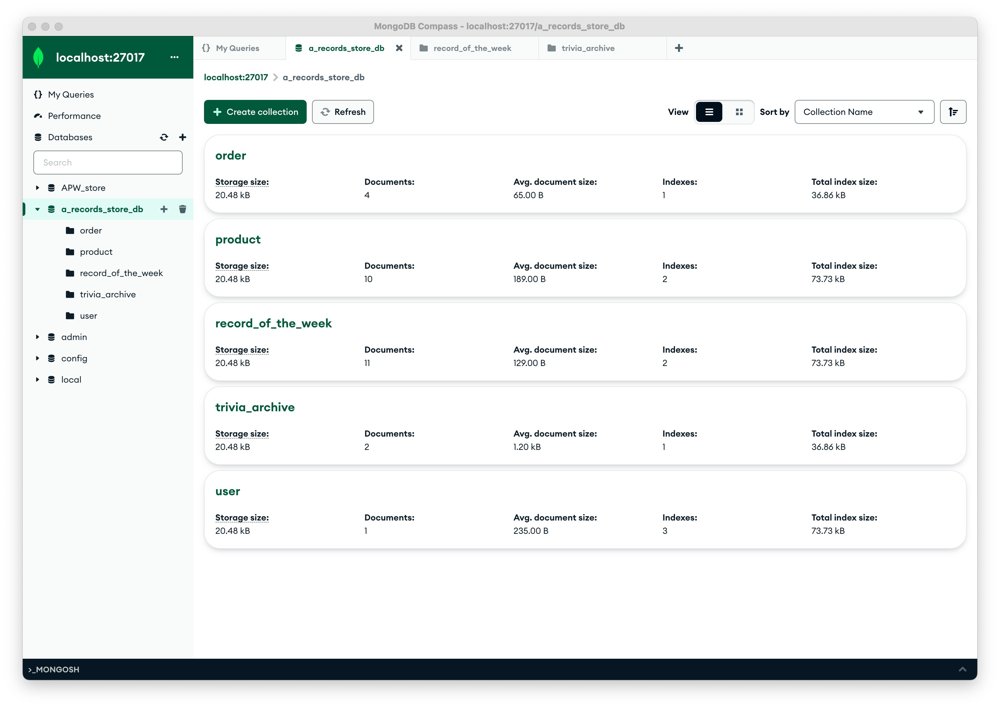

# A's Records Store

A web application for A's Records, an online store selling music records, built with Flask and MongoDB. 
This project includes user registration, login, a product list, a shopping cart, and an admin section to set the record of the week.

## Table of Contents

- [A's Records Store](#as-records-store)
  - [Table of Contents](#table-of-contents)
  - [Features](#features)
  - [Installation](#installation)
    - [Optional: Create a Customized Llama3 Model](#optional-create-a-customized-llama3-model)
  - [Usage](#usage)
  - [Project Structure](#project-structure)
  - [Routes](#routes)
  - [Models](#models)
    - [User](#user)
    - [Product](#product)
    - [RecordOfTheWeek](#recordoftheweek)
    - [Order](#order)
  - [Forms](#forms)
    - [LoginForm](#loginform)
    - [RegisterForm](#registerform)
    - [CheckoutForm](#checkoutform)
  - [Static Files](#static-files)
    - [CSS](#css)
    - [Images](#images)
    - [JavaScript](#javascript)
  - [Templates](#templates)
    - [Includes](#includes)
    - [Pages](#pages)
  - [License](#license)
  - [Original Images](#original-images)
  - [Screenshots](#screenshots)
    - [Homepage / Record of the Week](#homepage--record-of-the-week)
    - [Homepage / Hidden Trivia from AI Chatbot](#homepage--hidden-trivia-from-ai-chatbot)
    - [Admin - Set Record of the Week](#admin---set-record-of-the-week)
    - [Admin - Manage Products](#admin---manage-products)
    - [Product List](#product-list)
    - [Product List - Card View](#product-list---card-view)
    - [Shopping Cart](#shopping-cart)
    - [Checkout](#checkout)
    - [MongoDB Compass - a\_records\_store\_db](#mongodb-compass---a_records_store_db)
    - [MongoDB Compass - Products Collection](#mongodb-compass---products-collection)

## Features

- User registration and login
- User roles (admin and regular user)
- Admin page to set the record of the week
- Admin page to manage products (add, update, delete)
- Dynamic loading of images for records
- Display of the record of the week with a custom message
- Product listing with the ability to buy products
- Shopping cart functionality
- Checkout process integrated with Stripe for payment processing
- Flash messages for feedback
- Responsive design with a clean UI
- **New**: Fetch and display music trivia using the Ollama API

## Installation

1. **Clone the repository**:
    ```sh
    git clone https://github.com/AtsukoKuwahara/a_records_store.git
    cd a_records_store
    ```

2. **Set up a virtual environment**:
    ```sh
    python3 -m venv venv
    source venv/bin/activate  # On Windows use `venv\Scripts\activate`
    ```

3. **Install dependencies**:
    ```sh
    pip install -r requirements.txt
    ```

4. **Install MongoDB**:
    ```sh
    brew tap mongodb/brew
    brew install mongodb-community@5.0
    ```

    - Start MongoDB:
    ```sh
    brew services start mongodb-community@5.0
    ```

    - Create Database and Collections: Use MongoDB Compass or the MongoDB shell to create a new database named `a_records_store_db` and collections named `product`. (`user`, `order`, and `record_of_the_week` will be automatically created by operations on the webpage.)

5. **Install and set up Ollama**:
    - Download and install Ollama from the official website: [Ollama](https://ollama.com/download)
    - Follow the installation instructions provided on the website.
    - Start the Ollama API server:
    ```sh
    ollama serve
    ```

6. **Set environment variables**:
    Create a `.flaskenv` file in the root directory with the following content:
    ```
    FLASK_ENV=development
    FLASK_APP=main.py
    SECRET_KEY='a_secure_and_long_random_string'
    STRIPE_PUBLIC_KEY='your_stripe_public_key'
    STRIPE_SECRET_KEY='your_stripe_secret_key'
    ```

7. **Run the application**:
    ```sh
    flask run
    ```

8. **Customizing the Trivia Model**:
    - By default, the application uses the `llama3` model for trivia.
    - If you have created a custom model (e.g., `grooveguru`), update the route in `routes.py` to use your custom model:
    ```python
    model = 'grooveguru'  # Change to your custom model name
    ```

### Optional: Create a Customized Llama3 Model

   1. **Set the system instructions**:
       ```sh
       ollama run llama3
       >>> /set system "You are a renowned music expert specializing in providing rare, interesting, and verifiable trivia about music albums. Always provide detailed and accurate information, ensuring each response is unique and covers different aspects of the album, such as production details, album art, hidden messages, or cultural impact."
       >>> /show system
       ```
   2. **Set Parameters for Faster Responses**:
        ```sh
        (Sample Values:)
        >>> /set parameter temperature 0.7
        >>> /set parameter num_predict 100
        >>> /set parameter top_k 50
        >>> /set parameter top_p 0.9
        >>> /set parameter num_gpu 1
        >>> /set parameter repeat_penalty 1.2
        >>> /set parameter repeat_last_n 64
        ```

   3. **Save the customized model**:
       ```sh
       >>> /save grooveguru
       ```
       Created new model 'grooveguru'

   4. **Run the customized model**:
       ```sh
       ollama run grooveguru
       ```

## Usage

1. **Register a new user**: Navigate to `/register` to create a new account.
2. **Login**: Use the `/login` route to log in to the application.
3. **Admin Actions**:
    - Only the user with `user_id` 1 is an admin by default.
    - Navigate to `/admin` to set the record of the week and add a message.
    - Navigate to `/admin/manage_products` to add, update, or delete products.
4. **Browse Products**: View available products on the `/product` page.
5. **Shopping Cart**: Add products to the shopping cart and manage orders on the `/order` page.
6. **Checkout**: Proceed to checkout from the `/checkout` page.
7. **Fetch Trivia**: Click on the secret icon next to "A's Spotlight" to fetch interesting trivia about the album of the week using the Ollama API.

**Note**: The payment system is for demonstration purposes only. No real transactions will be processed.

## Project Structure

```
a_records_store/
│
├── .flaskenv
├── requirements.txt
├── config.py
├── main.py
├── application/
│   ├── __init__.py
│   ├── model.py
│   ├── routes.py
│   ├── forms.py
│   ├── shoppingcart.py
│   └── static/
│       ├── css/
│       │   └── style.css
│       ├── image/
│       │   ├── logo1.png
│       │   ├── logo2.png
│       │   ├── placeholder.png
│       │   └── IMG_1194_land.jpg
│       │   └── uploads/
│       │       └── [uploaded_files_here]
│       └── js/
│           └── checkout.js
│   └── templates/
│       ├── includes/
│       │   ├── nav.html
│       │   └── footer.html
│       ├── admin.html
│       ├── manage_products.html
│       ├── index.html
│       ├── login.html
│       ├── register.html
│       ├── product.html
│       ├── order.html
│       ├── checkout.html
│       └── layout.html
└── data/
    ├── products.json
    ├── coming_soon_products.json
    └── README.md
```

## Routes

- **GET /index**: Displays the homepage with the record of the week and coming soon products.
- **GET /register**: Registration page for new users.
- **POST /register**: Handles user registration.
- **GET /login**: Login page for existing users.
- **POST /login**: Handles user login.
- **GET /product**: Displays the product listing.
- **POST /order**: Manages the shopping cart and order process.
- **GET /admin**: Admin page to set the record of the week.
- **POST /admin**: Handles the update of the record of the week.
- **GET /admin/manage_products**: Admin page to manage products.
- **POST /admin/manage_products**: Handles the addition, update, and deletion of products.
- **GET /checkout**: Displays the checkout page.
- **POST /checkout**: Handles the checkout process and integrates with Stripe for payment processing.
- **POST /get_trivia**: Fetches trivia for the featured album using the Ollama API.

## Models

### User

Represents a user in the application.

- `user_id`: Unique identifier for the user.
- `first_name`: User's first name.
- `last_name`: User's last name.
- `email`: User's email address (unique).
- `password`: Hashed password.
- `role`: Role of the user (default is 'user').

### Product

Represents a product in the store.

- `product_id`: Unique identifier for the product.
- `title`: Title of the product.
- `artist`: Artist of the product.
- `label`: Label of the product.
- `price`: Price of the product.
- `image_url`: URL of the product image.

### RecordOfTheWeek

Represents the record of the week.

- `product_id`: Identifier of the product selected as the record of the week.
- `message`: Message from the admin about why this record was selected.
- `created_at`: Timestamp when the record was created (defaults to the current time).
- `image_url`: URL of the image associated with the record of the week.

### Order

Represents an order placed by a user.

- `user_id`: Identifier of the user who placed the order.
- `product_id`: Identifier of the ordered product.
- `quantity`: Quantity of the product ordered.
- `is_order`: Boolean indicating whether the order is placed or not.

## Forms

### LoginForm

Used for user login.

- `email`: Email field with validation.
- `password`: Password field with validation.
- `submit`: Submit button.

### RegisterForm

Used for user registration.

- `email`: Email field with validation.
- `password`: Password field with validation.
- `password_confirm`: Password confirmation field with validation.
- `first_name`: First name field with validation.
- `last_name`: Last name field with validation.
- `submit`: Submit button.

### CheckoutForm

Used for the checkout process.

- `name`: Name field.
- `address`: Address field.
- `city`: City field.
- `province`: Province field.
- `postal_code`: Postal code field.
- `payment_method`: Payment method field.
- `card_number`: Card number field (handled by Stripe).
- `expiry_date`: Card expiry date field (handled by Stripe).
- `cvc`: Card CVC field (handled by Stripe).
- `submit`: Submit button.

## Static Files

### CSS

- `style.css`: Contains all the styles for the application.

### Images

- `logo1.png`: Logo image with text.
- `logo2.png`: Logo image without text.
- `placeholder.png`: Placeholder image for products.
- `IMG_1194_land.jpg`: Background image.
- `uploads/`: Folder containing uploaded images.

### JavaScript

- `checkout.js`: Contains JavaScript functions for the checkout process.

## Templates

### Includes

- `nav.html`: Contains the navigation bar.
- `footer.html`: Contains the footer.

### Pages

- `admin.html`: Admin page to set the record of the week.
- `manage_products.html`: Admin page to manage products.
- `index.html`: Homepage displaying the record of the week and coming soon products.
- `login.html`: Login page.
- `register.html`: Registration page.
- `product.html`: Product listing page.
- `order.html`: Shopping cart and order page.
- `checkout.html`: Checkout page.
- `layout.html`: Base layout for the application.

## License

This project is licensed under the MIT License.

## Original Images

The images `logo1.png`, `logo2.png`, and `IMG_1194_land.jpg` are original works by the project owner and are included in this repository with permission.

## Screenshots

### Homepage / Record of the Week


### Homepage / Hidden Trivia from AI Chatbot


### Admin - Set Record of the Week


### Admin - Manage Products


### Product List


### Product List - Card View


### Shopping Cart


### Checkout


### MongoDB Compass - a_records_store_db


### MongoDB Compass - Products Collection

